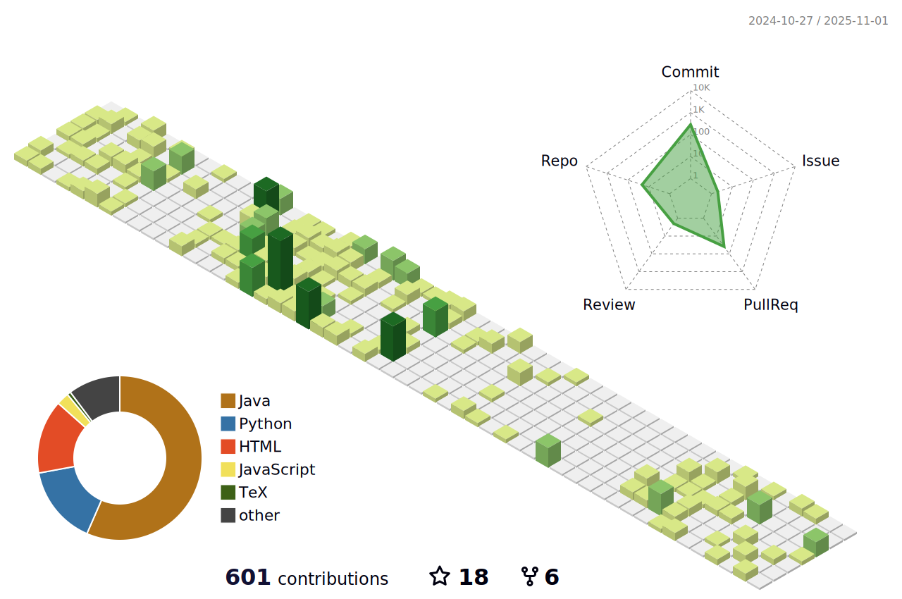

My name is [Minglai Yang](https://mlyann.github.io)
==================================================================================================================================

Researcher @[IVILAB](https://ivilab.org/), @[CLULAB](https://clulab.org/), @[ML4AI LAB](https://ml4ai.github.io/) && President @ [UArizona AI Club](https://uaaiclub.com/)
----------------
 </h2>


I am a final year undergraduate student at the [Computer Science, University of Arizona](https://cs.arizona.edu/) (```GPA: 4.0/4.0```) and am on track to complete my Bachelor’s degree just over **2** years (Fall 2025). As Founder & President of [**AI Club at UA**](https://uaaiclub.com/), I run workshops, host invited speakers, and lead industry collaborations—raising **$14K+** to support student AI research and education. In our CS department, I currently serve as both TA (Discrete Math I & II) and RA in [**CLULAB**](https://clulab.org/), [**IVILAB**](https://ivilab.org/) and [**ML4AI LAB**](https://ml4ai.github.io/). 

My research focuses on **NLP, mechanistic interpretability and reasoning**. Specifically, I study [how to build LMs reasoning robustly](https://arxiv.org/abs/2505.18761), [improve reasoning speed through copying](https://arxiv.org/abs/2502.08923), [analyze LLM planning in real-world tasks](https://ml4ai.github.io/tomcat/) and uncover their reasoning mechanism with Sparse Autoencoders. I am fortunate to conduct research advised by Prof. [Liangming Pan](https://liangmingpan.bio/), Prof. [Mihai Surdeanu](https://surdeanu.cs.arizona.edu/mihai/) and Prof. [Kobus Barnard](https://kobus.ca/). In addition, I also collaborate with Prof. [William Wang](https://sites.cs.ucsb.edu/~william/), Prof. [Adarsh Pyarelal](https://adarsh.cc/),  and Prof. [Chicheng Zhang](https://zcc1307.github.io/). 

I previously worked as a Machine Learning Engineer intern at [**CoreTechs**](https://www.coretechs.com/). This summer, I was a research intern at [**Knowledge Engineering Group (KEG), Tsinghua University**](https://keg.cs.tsinghua.edu.cn/), supervised by Prof. [Juanzi Li](https://keg.cs.tsinghua.edu.cn/persons/ljz/), working on LLM reasoning mechanisms.

<div style="
  border:1px solid #d0d7de !important;
  border-radius:0 !important; 
  background:#fff !important;
  padding:14px 18px;
  margin:22px 0;
  box-shadow:
    0 10px 20px rgba(0,0,0,0.15),
    0 3px 6px rgba(0,0,0,0.10) !important; 
  display:flex; gap:12px; align-items:flex-start;
">
  <div style="font-size:20px;line-height:1; margin-top:2px;">🎓</div>
  <div>
    <h5 style="margin:0 0 6px 0; color:#0366d6; font-weight:600;">
      PhD Applications – Fall 2026
    </h5>
    <p style="margin:0; color:#24292f; line-height:1.6;">
      I am applying to PhD programs in <b>NLP, interpretability, and reasoning</b> for Fall 2026.
      My goal is to develop LLMs that reason more robustly, efficiently, and transparently.
      If you’re working in this space, I’d love to connect!
    </p>
  </div>
</div>

* 🌍  I'm based in United States.
* ✉️  You can contact me at [mingly@arizona.edu](mailto:mingly@arizona.edu)
* 🤝  I'm open to collaborating on Projects. This is one project I'm contributing to: https://ml4ai.github.io/tomcat/
* 🤩 If you pay interest, please [visit my website](https://ymingl.com/).

# 💻Tech Stack
<p align="left">
  <!-- Python -->
  <a href="https://www.python.org/" target="_blank" rel="noreferrer"></a>
  <!-- Git -->
  <a href="https://git-scm.com/" target="_blank" rel="noreferrer"></a>
  <!-- Java -->
  <a href="https://www.oracle.com/java/" target="_blank" rel="noreferrer"></a>
  <!-- HTML5 -->
  <a href="https://developer.mozilla.org/en-US/docs/Glossary/HTML5" target="_blank" rel="noreferrer"></a>
  <!-- CSS3 -->
  <a href="https://www.w3.org/TR/CSS/#css" target="_blank" rel="noreferrer"></a>
  <!-- JavaScript -->
  <a href="https://www.javascript.com/" target="_blank" rel="noreferrer"></a>
  <!-- Matlab -->
  <a href="https://www.mathworks.com/products/matlab.html" target="_blank" rel="noreferrer"></a>
  <!-- AWS -->
  <a href="https://aws.amazon.com/" target="_blank" rel="noreferrer"></a>
  <!-- MySQL -->
  <a href="https://www.mysql.com/" target="_blank" rel="noreferrer"></a>
  <!-- NodeJS -->
  <a href="https://nodejs.org/" target="_blank" rel="noreferrer"></a>
  <!-- Swift -->
  <a href="https://swift.org/" target="_blank" rel="noreferrer"></a>
  <!-- PHP -->
  <a href="https://www.php.net/" target="_blank" rel="noreferrer"></a>
  <!-- Linux -->
  <a href="https://www.linux.org/" target="_blank" rel="noreferrer"></a>
<!-- Azure -->
<a href="https://azure.microsoft.com/" target="_blank" rel="noreferrer"></a>

</p>


# 📊GitHub Stats :
[](https://visitcount.itsvg.in)



### Coffee Chat

To everyone, if you would like to chat about life, career plan, or research ideas related to AI/ML, feel free to email me ([mingly@arizona.edu](mailto:mingly@arizona.edu)) to schedule a meeting. I will dedicate 30 mins every week for such meetings. 

</ul>
